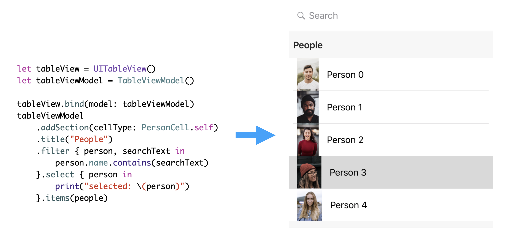

# PresentTableViewModel

PresentTableViewModel provides a simple, fluent style API for creation of UITableViews using your own model and cell classes.
The table view model serves as the your table view's `dataSource`, handling the boilerplate of managing an array of your model objects.  Your tables can have multiple sections, each with its own model and cell type.  Search and selection logic is configured for each section simply by providing code blocks that work with your model type.

</img>

## Installation
### CocoaPods

```swift
pod 'PresentTableViewModel', :git => 'https://github.com/presentco/PresentTableViewModel.git'
```

For more information see ([Cocoapods.org](https://cocoapods.org/))

### Demo

Check out the demo project for a complete working example.

### Basic usage

We'll start with a simple `Person` model and `PersonCell`.  The cell is a plain UITableViewCell that adopts the `TableViewModelCell` protocol to let us know what type of model it works with.

```swift
struct Person {
    let image: UIImage
    let name: String
}
class PersonCell: UITableViewCell, TableViewModelCell {
    typealias ModelType = Person
    func apply(model person: Person) {
        self.textLabel?.text = person.name
        self.imageView?.image = person.image
    }
}
```

Now we initialize a `UITableView` and bind a Present `TableViewModel` as its data source.  We add a section to the table view, specifying our `PersonCell` as the cell type and provide an array of our `Person` models when ready.

```swift
let tableView = UITableView()
let tableViewModel = TableViewModel()
tableView.bind(model: tableViewModel)

let personSection = tableViewModel.addSection(cellType: PersonCell.self)
personSection.items = people // [Person]
```

### Filtering and Selection

To be notified of selected cells provide a `select` block:

```swift
tableViewModel
  .select { person in ... }
```

or using Rx via the `selected` observable:

```swift
tableViewModel
  .selected.do(onNext: { person in ... })
```

To support search / filtering simply supply a filter block accepting your model type and the search text string, e.g.:

```swift
tableViewModel
  .filter { person, searchText in
      return person.name.contains(searchText)
  }
```

The search text is applied to the tableViewModel (all sections) via the `searchText` property.  See the demo application for a full example.


### Parameters

By default empty sections are hidden.  To show sections with no visible cells change the `hideEmptySections` property.

```swift
  hideEmptySections = true
```

### Feedback

We are open sourcing this and other components that we found useful during the development of our commercial application.  We welcome any feedback, and discussion.
